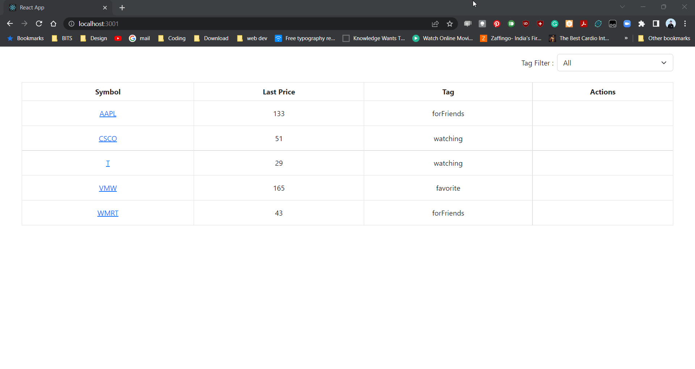

# Stocks App

This app contains the server and client code to run the UI to display and filter stocks.

<br/>

### Libraries Used
- Json-server : To serve Mock API
- ReactJS : To develop UI
- Bootstrap : For styling

<br/>

## Steps to run Server

### 1. Open server folder and then run: (This will install json-server)
  ```
  npm install
  ```
### 2. Now, run: (This will start the server on port 3000)
  ```
  npm run start
  ```
<br/>

## Steps to run client

### 1. Open client folder in terminal and then run: (This will install all the dependencies)
  ```
  npm install
  ```
### 2. Now, run: (This will start the client on port 3001)
  ```
  npm run start
  ```
### 3. You should be able to see the UI in `http://localhost:3001`

<br/>
<br/>

## Running components Unit tests:

### 1. Navigate to client and then run
  ```
  npm run test
  ```
<br/>
<br/>

## Demo
